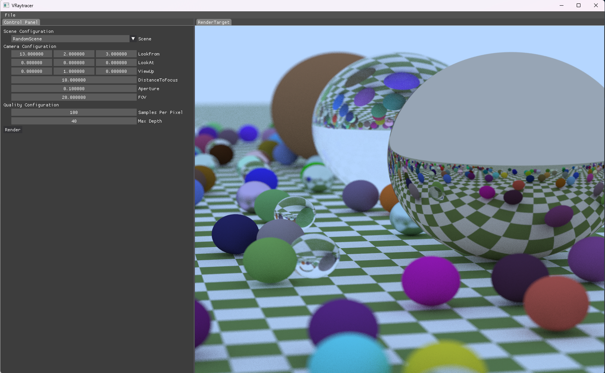

# VRaytracer

<div align="center">
    
</div>
<h4 align="center">
  <strong>VRaytracer</strong> is a raytracer written in C++
</h4>

<p align="center">
    <a href="https://github.com/zzxzzk115/VRaytracer/actions" alt="CI-Windows">
        </a>
    <a href="https://github.com/zzxzzk115/VRaytracer/actions" alt="CI-Linux">
        </a>
    <a href="https://github.com/zzxzzk115/VRaytracer/actions" alt="CI-MacOS">
        </a>
    <a href="https://github.com/zzxzzk115/VRaytracer/issues" alt="GitHub Issues">
        
    </a>
    <a href="https://github.com/zzxzzk115/VRaytracer/blob/master/LICENSE" alt="GitHub">
        
    </a>
</p>

> **VRaytracer** is still under development.

## Screenshots



## Features

- GUI with ImGui
- Multi-threaded rendering
- Configurable scenes
- PBR Shading & Materials (TODO)
- Wavefont OBJ support (TODO)

## Prerequisites

To build **VRaytracer**, you must first install the following tools.

### Windows 10/11

- Visual Studio 2019 (or more recent) with C++ Desktop Development Environment
- CMake 3.20 (or more recent)
- Git 2.1 (or more recent)

### Ubuntu 22.04 (Linux or WSL2)

Install prerequisite packages:

```bash
sudo apt-get update
sudo apt-get install build-essential cmake git libx11-dev libxrandr-dev libxinerama-dev libxcursor-dev libxi-dev mesa-common-dev libomp-dev
```

### MacOS

- XCode 13 (or more recent)
- CMake 3.20 (or more recent)
- Git 2.1 (or more recent)

## Build VRaytracer

Clone this repository:

```bash
git clone --recursive https://github.com/zzxzzk115/VRaytracer.git
```

### Build on Windows

Build it automatically:

Just double-click `BuildWindows.bat ` or you can simply use Jetbrains CLion to debug or release.

Build it manually:

```bash
cmake -S . -B build
```

Then open the generated solution file with Visual Studio.

### Build on Linux / WSL2

Build it automatically:

```bash
./BuildLinux.sh
```

### Build on MacOS

Build it automatically:

```bash
./BuildMacOS.sh
```

Build it manually:

```bash
cmake -S . -B build -G "Xcode"
```

Then open the generated project file with XCode.

> If you didn't find OpenMP, you may need to install libomp with [Homebrew](https://brew.sh/): 
> 
> ```bash
> brew install libomp
> ```
> 

## Acknowledgements

We would like to thank the following projects for their invaluable contribution to our work:

- [spdlog](https://github.com/gabime/spdlog) (Logger)
- [imgui](https://github.com/ocornut/imgui) (GUI)
- [glad](https://github.com/Dav1dde/glad) (OpenGL Loader & Extension)
- [glfw](https://github.com/glfw/glfw) (Window Abstraction)
- [stb](https://github.com/nothings/stb) (Image Loader)
- [args](https://github.com/Taywee/args) (CLI Arguments Handler)

## License

This project is licensed under the [MIT](https://github.com/zzxzzk115/VRaytracer/blob/master/LICENSE) license.
